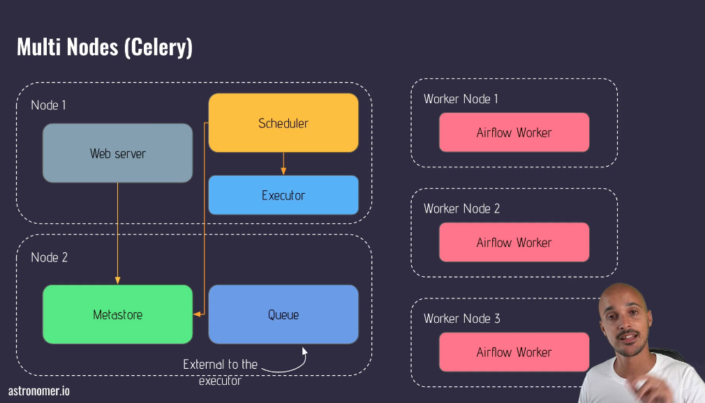
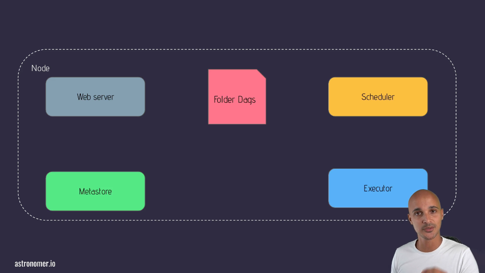

# Essentials

## Questions

- do we have multiple node arch? what do we use to queue tasks?
- do we have multiple schedulers?
- do we have default waiting periods for webserver and scheduler?

## What is Airflow?

- an open source platform to programatically author, schedule, and monitor workflows
- dynamic
- scalable
- interactive - use UI, CLI, terminal
- extensible - you can create your own plugins

## What Airflow is NOT

- not a data processing framework - don't try to process terabytes of data like spark
- not a streaming solution

## Core Components

- web server - UI
- scheduler - it is possible to have multiple schedulers
- metadata database
- executor - defines how your tasks are going to be executed by airflow (HOW)
- worker - where the task is ACTUALLY executed (WHERE)

## Architectures

- single node architectures
  - executor updates the metastore
  - all components interact with the metastore
- multi-node architecture

  - node 1
    - webserver, scheduler, executor
  - node 2
    - meta database and queue are in a separate node
  - node 3

    - airflow workers are in a separate node

    

## Core Concepts

- DAG
  - Directed Acyclic Graph (NO LOOPING, directed edges)
  - aka Data Pipeline
- Operator
  - task in the DAG
  - object
  - a very simple example is to open a file and read it out
  - 3 types
    - action
      - execute something in the pipeline
      - bash, python, sql, postgres and so on
    - transfer
      - move data from source to destination
    - sensor
      - watch for something to occur
      - for example, watch for a file to land in a specific destination so you can move on to the next task
  - task
    - instance of an operator in a DAG
    - when a task is ready to be scheduled or triggered, it is a task-instance-object
  - dependencies
    - the edges in the DAG
    - set_upstream OR set_downstream but use the >> or the << the bit shift operators to note directionality
  - workflow
    

## Task Lifecycle

- web server parses DAGs every 30 seconds by default
- schedule parses for new DAGs every 5 minutes by default
- usually there's a dags folder
  - add specific dags to this folder
- task instance lifecycle
  - once ready to be parsed, there is a dag run is created
  - task instance object is created with the status scheduled
  - once sent to the executor it has the status queued
  - when running, status is updated
  - once complete, modified again with success or failure

## Extras and Providers

- Extras
  - a big package installing all dependencies (for example, the celery dependencies)
  - in the case of celery, the core airflow is extended
- Providers
  - allows you to add functionality to airflow
  - for example, postgres is not a default in the core install, so you have to install postgres provider
- What is the difference?
  - extras have an associated set of dependencies
    - for example, k8s
